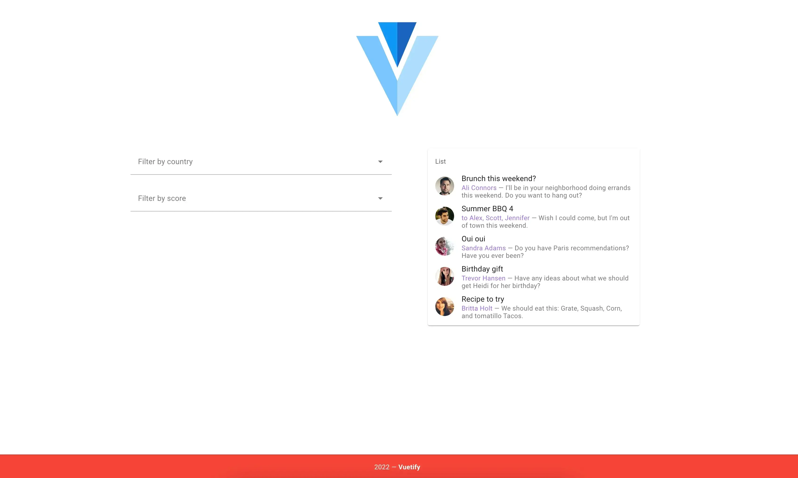

# Проект Lists and filters (тестовое задание)

[Ссылка на проект на Vercel](https://list-and-filters.vercel.app/)

## Описание задания

[Исходный проект](https://github.com/inetstudio/vue-js-interview) на Vue v2 Options API, собранный с использованием готовых функциональных
решений и плагинов, таких как Vue-CLI и Vuetify

✔ Необходимо разделить содержимое компонента `ContentBlock` на отдельные компоненты для фильтров и списка
   пользователей.  
✔ Добавить в структуру данных списка пользователей `users` недостающие для фильтрации параметры, и предусмотреть
   возможность его динамической загрузки из внешнего `.json API`.  
✔ Реализовать фильтрацию универсально, используя _Vuex_ (или другое хранилище состояний) так, что бы состояние фильтров
   было доступно другим компонентам.  
✔ Добавить в структуру данных пользователя информацию об адресе проживания и выводить её при клике на портрет.  
✔ `(опционально)` Перенести проект на Vue v3 Composition api (переносить Vuetify необязательно).  
✔ `(опционально)` Добавить визуальное обозначение процесса фильтрации (**preloader**).  

`-` `(опционально)` Сопроводить процесс фильтрации "интересным" визуальным переходом (`transitions`).  
`-` `(опционально)`Использовать TypeScript

### Стек:

* JS
* Vue v3 Composition API + Vuex v4
* Vuetify

## Директории

`/components` — папка с компонентами приложения  
`/plagins` - папка с установллеными плагинами для приложения  
`/store` - папка с файлами глобального хранилища (стейта) приложения  
`/assets` - папка с изображениями

## Установка зависимостей и запуск проекта

##### `npm i` – установить зависимости

##### `npm serve` – запуск devServer на localhost

##### `npm build` – production сборка проекта

##### `npm lint` – запуск ESLint
